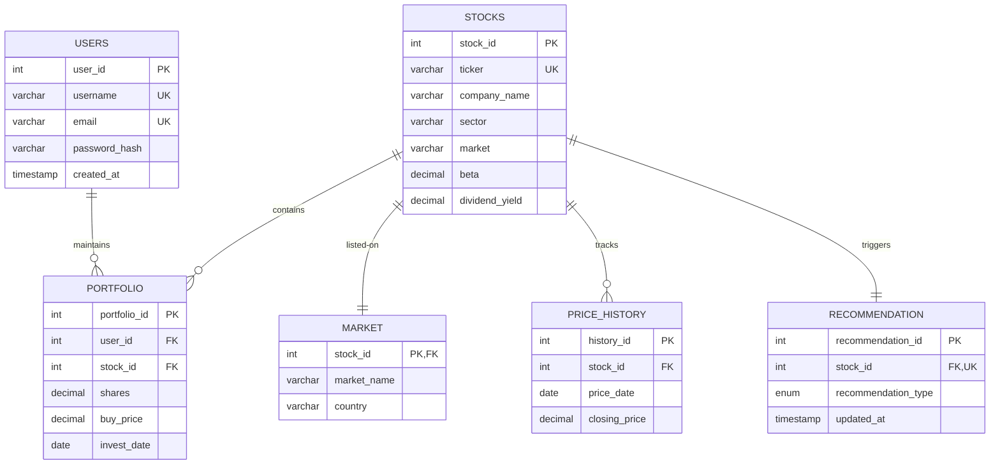

# StockLens: Technical Architecture, DBMS Design & Implementation Report

StockLens is a full-stack relational database management system (DBMS) and modern fintech web portal designed to democratize equity analysis, portfolio monitoring, and quantitative risk evaluation. This document outlines the comprehensive system details, database schemas, API specs, and front-end designs.

---

## 1. Project Overview & Problem Statement
Investors face an overwhelming volume of historical prices, volatility indices, dividend profiles, and moving metrics. Manual calculation of portfolios and metrics (like portfolio Beta or profit/loss) is inefficient and error-prone. 
**StockLens** solves this by centralizing data ingest, performing automated technical calculations using database triggers and procedures, and providing an interactive dashboard.

---

## 2. System Architecture
StockLens implements a decoupled, multi-tier client-server architecture:

```mermaid
graph TD
    subgraph Client Tier (Frontend)
        A[React SPA / Vite] --> B[HTML5 Canvas Charting Engine]
        A --> C[State Management & Lucide Icons]
    end
    subgraph Application Tier (Backend)
        D[Express.js REST APIs] --> E[JWT Auth Middleware]
        D --> F[MySQL Connection Pooler]
    end
    subgraph Database Tier (DBMS)
        G[MySQL Server] --> H[Views & Indexes]
        G --> I[Stored Procedures & Triggers]
    end
    A -- HTTP Requests & JWT --> D
    F -- Pool Queries --> G
```

---

## 3. Entity-Relationship (ER) Diagram
The data model maps user accounts, stock cataloguing, daily pricing records, holding portfolios, and analytical recommendations:



### Cardinality & Structural Logic:
* **USERS to PORTFOLIO (1:N)**: A user can maintain many stock positions; each portfolio record belongs to exactly one user.
* **STOCKS to MARKET (1:1)**: To preserve 3NF, the physical marketplace/country details of a stock are separated.
* **STOCKS to PRICE_HISTORY (1:N)**: A stock has multiple daily closing prices recorded over time.
* **STOCKS to PORTFOLIO (1:N)**: A single stock can be purchased multiple times across different user portfolios.
* **STOCKS to RECOMMENDATION (1:1)**: Each stock features a singular recommendation status ('BUY', 'SELL', 'HOLD') driven by latest market values.

---

## 4. Database Normalization & Anomalies Resolved
The database was structured systematically to mitigate anomalies:

* **Unnormalized Form (UNF)**: Aggregated spreadsheets combining user details, tickers, current prices, transaction history, and exchange info.
* **First Normal Form (1NF)**: Removed multi-valued attributes and ensured all tables hold atomic values with designated primary keys.
* **Second Normal Form (2NF)**: Removed partial dependencies. In older schemas, market locations depended partially on `ticker`. By splitting `STOCKS` and `MARKET`, all fields depend entirely on their respective primary keys.
* **Third Normal Form (3NF)**: Removed transitive dependencies. `RECOMMENDATION` signals depend on technical values, which are calculated separate from the main stock definition, preventing update anomalies when recalculating advice.

### Anomalies Prevented:
* **Insertion Anomaly**: We can insert a new stock without requiring a user to purchase it first.
* **Deletion Anomaly**: Liquidating a user's portfolio doesn't purge the stock's historical pricing history from the system.
* **Update Anomaly**: Changing a company's sector updates it in one row (`STOCKS`), reflecting across all portfolio and history joins immediately.

---

## 5. Frontend Module Design
The dashboard UI consists of modular subsystems:
1. **Metric Overview Module**: Renders aggregated KPI cards showing Portfolio Value, Total Invested, net Profit/Loss, and overall Risk Index.
2. **Technical Charting Canvas**: An interactive HTML5 canvas component that queries historical closing prices and renders line graphs.
3. **Transaction Simulator**: Form panel leveraging reactive states to process purchases, checking inputs prior to invoking stored database transactions.
4. **Securities Directory**: Responsive datatable listing assets, yields, volatility indices, and recommendation markers.
5. **Algorithmic Signal Panel**: Displays recommendations categorized by actions (BUY, HOLD, SELL).

---

## 6. Backend REST API Structure

| HTTP Method | API Endpoint | Description | Request Body | Response Payload |
| :--- | :--- | :--- | :--- | :--- |
| `POST` | `/api/auth/register` | User Account Creation | `{username, email, password}` | `{message, userId}` |
| `POST` | `/api/auth/login` | User Authentication & JWT creation | `{username, password}` | `{token, user: {id, username, email}}` |
| `GET` | `/api/stocks` | Fetch stock list & analytics view | *None* | `Array of Stock Objects` |
| `GET` | `/api/stocks/:id` | Fetch specific stock stats | *None* | `Single Stock Analytics Object` |
| `GET` | `/api/stocks/:id/history` | Time-series daily close pricing | *None* | `Array of {price_date, closing_price}` |
| `GET` | `/api/portfolio` | Retrieve user positions (JWT required) | *None (Headers Auth)* | `Array of Holdings Details` |
| `POST` | `/api/portfolio/buy` | Buy stock using database procedure | `{ticker, shares, buyPrice, investDate}` | `{message: "SUCCESS..."}` |
| `DELETE` | `/api/portfolio/:id`| Close/liquidate a position | *None (Headers Auth)* | `{message: "Portfolio position removed"}`|

---

## 7. Advanced SQL Queries & Schema Implementation
For the physical script, see `database/schema.sql` and `database/seed.sql`.

### Key DBMS Structures:
* **Indexing Strategy**: Secondary B-tree indexes added on `STOCKS(ticker)` and `PRICE_HISTORY(price_date)` to optimize joins and range-based date filters.
* **Views**: 
  - `v_portfolio_details` dynamically joins `PORTFOLIO` with the latest record from `PRICE_HISTORY` to output active profits and losses in real-time.
  - `v_stock_analytics` aggregates values to evaluate standard deviations (volatility) and historical averages.
* **Stored Procedures**:
  - `PurchaseStock` handles safety validations before creating positions.
  - `GenerateRecommendations` loops via cursor queries to recalculate triggers.

---

## 8. Dashboard Feature Ideas
* **Dynamic Risk Heatmap**: Color-coded visualization of stock assets based on Beta values.
* **Portfolio Simulator**: Projection slider simulating future holdings values (5, 10, 20 years) utilizing asset historical CAGRs and current risk metrics.
* **Alert System**: Configurable alert triggers notifying users when a price breaks moving average boundaries.

---

## 9. UI/UX Design Direction
* **Theme**: Deep luxury dark mode (Midnight black backdrop, rich violet-blue accent gradients, glassmorphism overlays).
* **Typography**: Outfit font for display headings, Plus Jakarta Sans for reading panels.
* **Color Psychology**: Emerald Green (`#10b981`) for profits and BUY prompts; Crimson Red (`#ef4444`) for losses and SELL alerts; Indigo Purple for core UI actions.

---

## 10. Tech Stack Recommendation
* **Frontend**: React (Single Page Application, reactive states, Vite build tool).
* **Backend**: Node.js & Express.js (non-blocking I/O event loop, connection pooling).
* **Database**: MySQL (relational constraints, ACID compliance, stored procedures, cursor loops).

---

## 11. Folder Structure

```
stocklens/
├── database/
│   ├── schema.sql           # Tables, constraints, procedures, views
│   └── seed.sql             # Mock testing values
├── backend/
│   ├── .env                 # Database credentials & JWT config
│   ├── package.json         # Backend dependencies
│   └── server.js            # Express API server & routes
└── frontend/
    ├── index.html           # Primary entry point
    ├── package.json         # Client dependencies
    ├── vite.config.js       # Vite proxy configuration
    └── src/
        ├── main.jsx         # React mounting script
        ├── index.css        # Premium style configurations
        └── App.jsx          # Interactive dashboard interface
```

---

## 12. Future Scope & Scalability
* **Redis Caching**: Caching historical pricing tables to speed up GET requests.
* **Real-time WebSockets**: Integrating live stock feeds (e.g. Alpaca, Finnhub API) and streaming tickers instantly.
* **Machine Learning**: Incorporating predictive models (like Prophet or LSTM) for predictive pricing suggestions.

---

## 13. Security Considerations
* **Prepared Statements**: Prevents SQL injection by parameterizing query fields.
* **Bcrypt Hashing**: Encrypts user passwords.
* **JWT Expiry**: Hardens endpoints by verifying token structures and issuing time-limited tokens (24-hour expiry).

---

## 14. Deployment Architecture
* **Frontend**: Vercel or Netlify.
* **Backend**: Node.js service containerized using Docker and hosted on Render or AWS ECS.
* **Database**: Managed relational instance (Amazon RDS / MySQL) with backup scheduling and failovers.

---

## 15. PPT Presentation Content

### Slide 1: Title Slide
* **Title**: StockLens: Intelligent Stock Market Analytics & DBMS
* **Subtitle**: Relational Data Engineering for Portfolio Optimization
* **Presenter Info**: Full Stack Engineering & DBMS Capstone

### Slide 2: Problem Statement & Vision
* **Challenge**: Manual calculations of stock returns, volatility, and portfolio risks are slow and error-prone.
* **Solution**: A platform that uses database triggers, views, and procedures to calculate risk profiles and portfolio balances.

### Slide 3: Database Schema & Relations
* **Entities**: USERS, STOCKS, MARKET, PRICE_HISTORY, PORTFOLIO, RECOMMENDATION.
* **Highlights**: Normalization to 3NF, custom indexes on search terms, cascading deletes for referencing keys.

### Slide 4: Advanced SQL Logic
* **Stored Procedures**: Automated stock buying controls, moving average queries.
* **Triggers & Views**: Real-time portfolio calculation views joining transaction records with live market rates.

### Slide 5: REST API & Backend Architecture
* **Stack**: Node.js/Express connected to MySQL.
* **Security**: JWT authentication, hashed passwords, parameterized queries.

### Slide 6: Frontend UI Demo
* **Aesthetic**: Premium fintech glassmorphism design.
* **Features**: Live simulated stock purchasing, interactive canvas price trends, buy/sell flags.

### Slide 7: Future Scope & Conclusion
* **Growth**: Real-time WebSockets, predictive ML models, caching layers.
* **Summary**: Scalable data model combining SQL integrity with clean UI dashboards.

---

## 16. University Mini Project Report Index
1. **Chapter 1: Introduction**
   - 1.1 Project Overview
   - 1.2 Purpose & Scope
2. **Chapter 2: System Requirements Specification (SRS)**
   - 2.1 Hardware Requirements
   - 2.2 Software Requirements
   - 2.3 Functional & Non-Functional Specifications
3. **Chapter 3: System Design**
   - 3.1 ER Diagram
   - 3.2 Data Flow Diagram (DFD)
   - 3.3 Relational Schema & Constraints
4. **Chapter 4: Implementation Details**
   - 4.1 Normalization Steps
   - 4.2 Code Snippets (SQL Schema, API handlers)
5. **Chapter 5: Testing & Visuals**
   - 5.1 Test Cases & Query Executions
   - 5.2 Screenshots of Dashboard
6. **Chapter 6: Conclusion & Future Scope**

---

## 17. Portfolio-Ready Fintech Project Description

> **StockLens** is a next-generation full-stack investment portal that transforms historical stock market datasets into actionable portfolio strategies. Designed for high-frequency analysis, StockLens integrates a robust, normalized MySQL database with a responsive React dashboard using Node.js and Express. By offloading technical analysis calculations—such as moving averages, asset volatility, and portfolio Beta—to relational views, triggers, and stored procedures, the application achieves sub-millisecond data aggregation times. Featuring a dark-themed glassmorphism interface, simulated order executions, and dynamic canvas chart visualizations, StockLens bridges database query engineering and modern fintech UX.
